= Creative Log
:toc:

== 2023-04-03/09

=== 2023-04-07 Friday
Further defelopment of RPG7, overhauled how creatures spawn on the map:
implemented a basic creature spawning framework to make it easier to build a
database powered spawn-table system later. No user-visible changes though, but
if anyone's realy curious you can see the repo on
link:https://github.com/jinnturtle/RPG7_White_Shadow/commit/a2c7fd521540895d2f8f97d09a1d63194dcc8b3c[github].

I did a lot of fun observing and resolving a bug which caused all creatures on
the map to respond to player keyboard input due to some accidental re-use of
memory by and uninitialized variable.
link:videos/rpg7/bug_everyone_moves_202304070001-0120.mp4[Wild bug captured on video.]

=== 2023-04-06 Thursday
Resumed development of RPG7, added a second creature type and started some
initial design on how creature types will be configured in the future. If
possible the solution will be similar for items and other content that has
potential for multiple similar configurations, e.g. usable items etc.

.Multiple kinds of creatures on the map
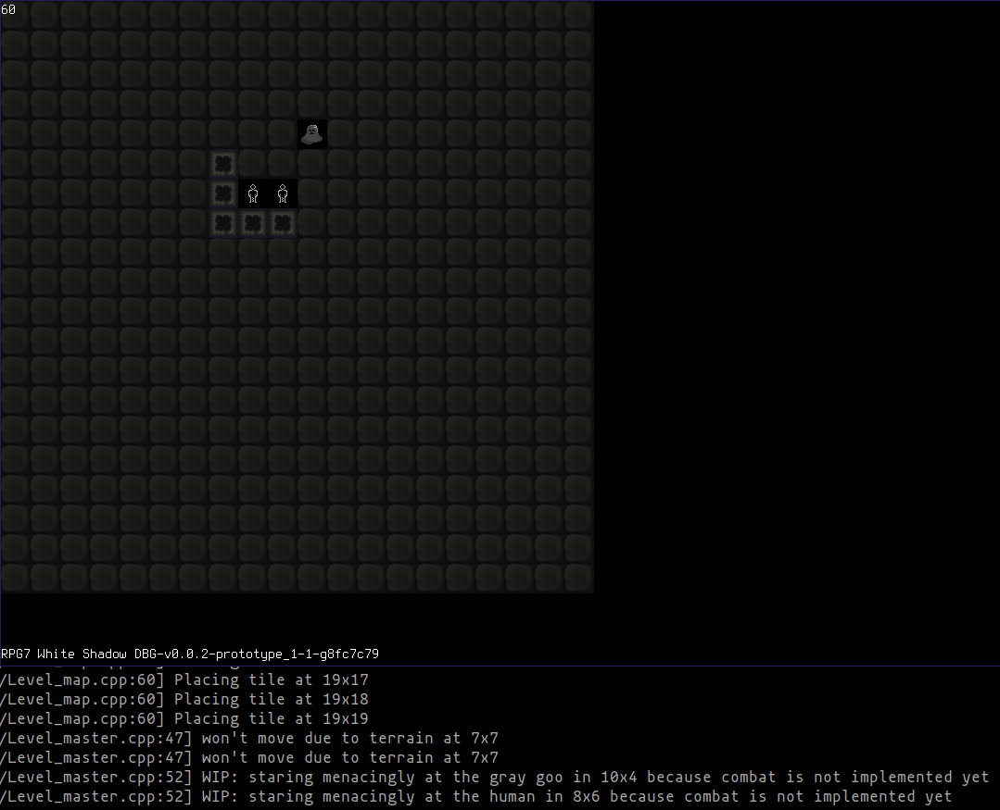

.Further iteration on creature control system design
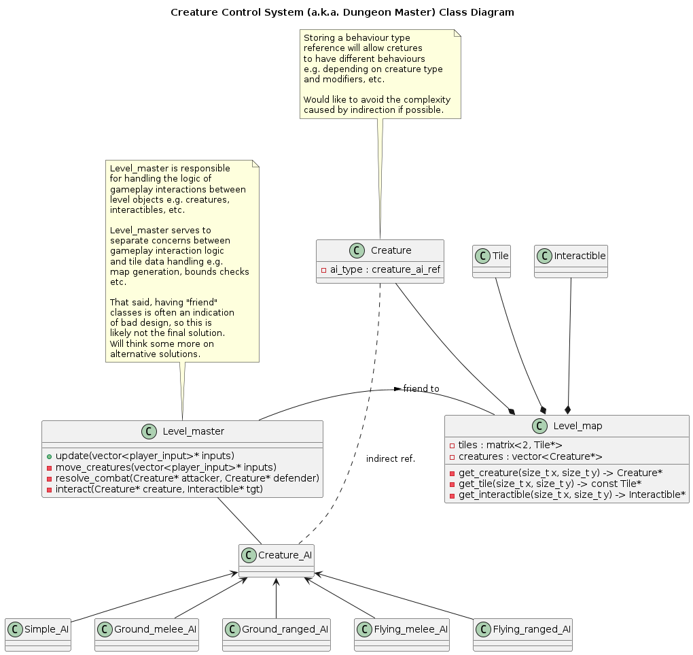

== 2023-01-23/29

Thursday worked a bit more on RPG7, made a 1st design pass for the creature
control system and implemented parts of said design i.e.
link:videos/rpg7/movement_w_walls.mp4[can't walk through walls anymore]
(again, but this time more properly implemented).

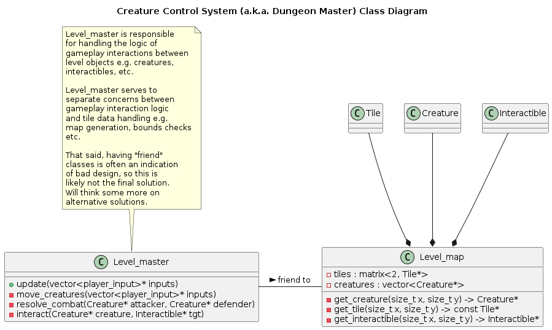

Friday managed to put in some more work into level object interaction system
for RPG7, and the groundwork is done, which marks completion of `v0.0.2` for
`prototype_1` yay!

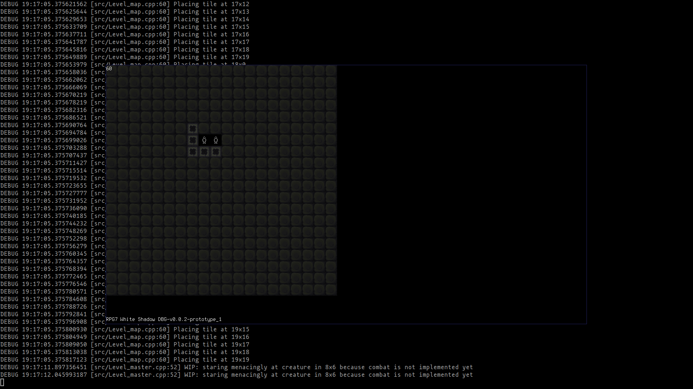

== 2023-01-16/22
Was testing out brush creation capabilities in Krita last week and wanted to
test out the brushes and get a bit more familiar with the software, by Monday
had a vague idea for part of a painting, but mostly just did random strokes
until something started taking shape. Probably will be returning to finish this
sometime soon.

.The city of dreams doesn't sleep
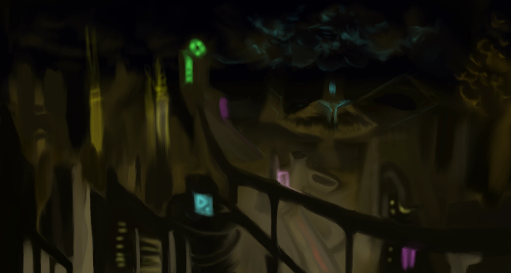

Wednesday sat down to give the above painting another go, started adding some
details, then repainting some things and ended up with something I actually
like. Reluctant to call it done but suppose I will as I feel like moving on.
Maybe will re-visit the idea some time later.
Also, since we're calling it done, manned up to sign it and upload to
https://www.deviantart.com/jinnturtle/art/Old-Horizons-New-945752477[deviantart]
. 174 views later, nobody went out of their way to say it sucks, and someone
actually liked it, quite happy with that result!

.Old Horizons New
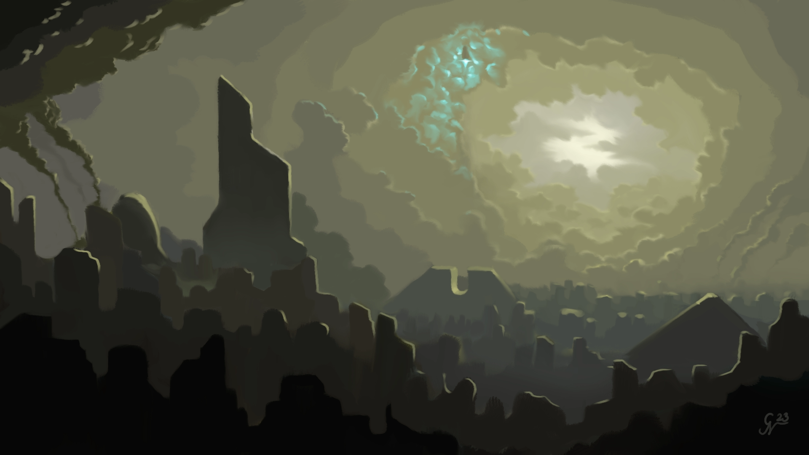

Sunday managed to sit down and do some systems design and coding for RPG7,
the character can now be moved with keyboard input, yay!
link:videos/rpg7/movement.mp4[Here's proof!]
Still just a POC though ;)

Also big thanks to brother K for the tile graphics contribution!

.Character control system requirements analysis via activity diagram, 1st pass
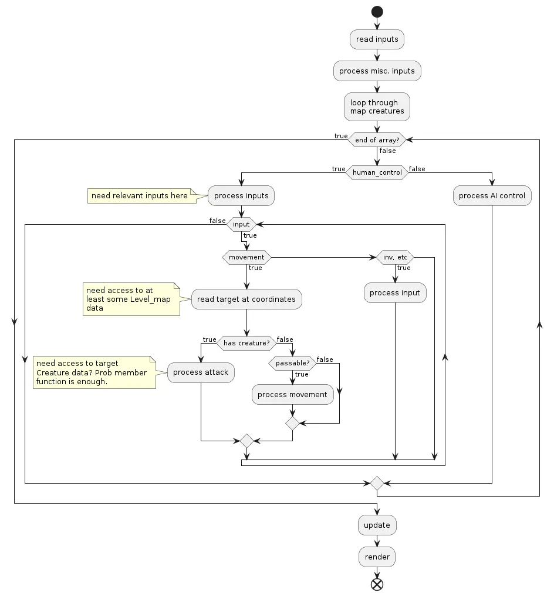

== 2023-01-09/15
Early in the week started playing around a bit with Blender, eventually made an
attempt at game item graphics, "complete" was not the goal here.

.Sci-fi spaceship ammo
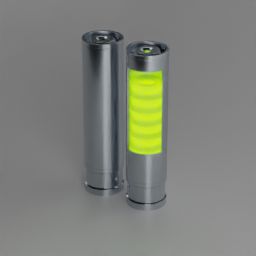

=== Project RPG7 White Shadow
Spent a couple evenings through the week designing and coding a game project
I've started just before Christmas last year. Working title: RPG7 White Shadow,
because it's my 7th attempt of making an RPG.

Goal of project RPG7 is to not throw due to "this is not as perfect as it could
be", before meeting at least a few criteria of "playability", I'll post a more
concrete list before the end of the month.

Things done this week::
* Designed, re-designed and finally implemented the groundwork for the level
and "terrain" system.
* Begun designing player and creature control system, and some stuff for
handling keyboard and mouse input.

.RPG7 game is actually running and showing graphics
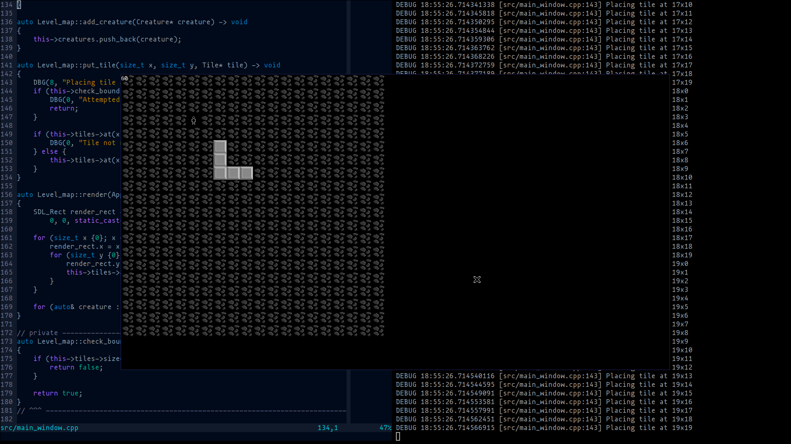

.RPG7 level terrain system ideas
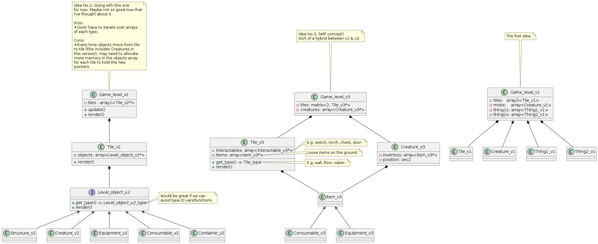

=== New 3D Art Project: Into the Scar of the World
Started working on a new 3D scene, an idea that has been rattling around in my
mind ever since the beginning of my hiatus from graphics in 2010-ish.

Saturday took a stylus into my hands for the first time in a decade and with a
stiff, awkward hand begun sketching (after gulping down the terror of a staring
at a blank page).

I promised myself that I'd have something usable at the end of an hour, and I
did. Even if at the time "usable" sounded a bit generous this is in fact
infinitely better than nothing.

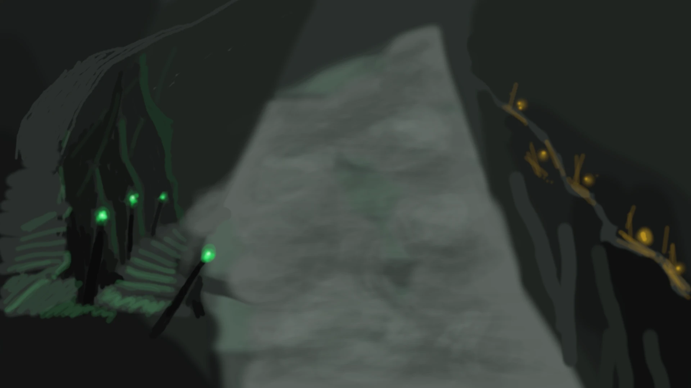

Sunday, about 10am in the morning, I opened Blender and made a promise that by
6pm, I'd be done with the first exploratory experiment into the concept,
whatever "done" may look like.

I did get carried away learning procedural textures, and needlessly poured half
of the entire session time into the small crystal inside the lanterns.

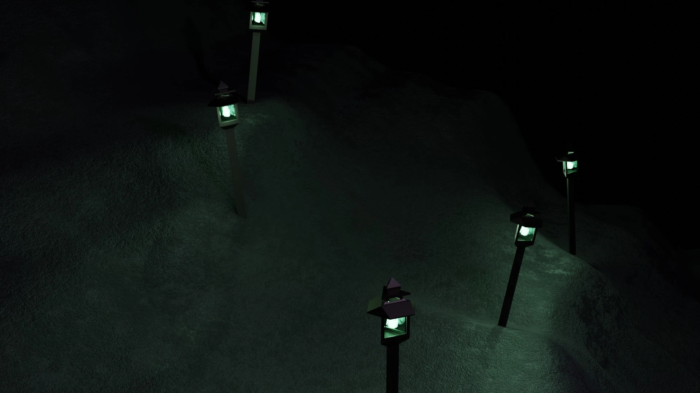

This is the most complex scene I've made with Blender in my life so far (which
isn't saying much) and considering I haven't done _any_ procedural texturing
since about 2009 (never knew much about it to begin with) I'm quite happy with
what I learned and re-learned this day.

=== Summary
While it's not much as lots of time went into refreshing my very rusty skills,
I'm immensely proud of daring to be "good enough", learn from what I don't
like, and move to the next challenge.

== TODO before 2023-02-01
* Translate RPG7 minimum requirements list from the mind into tangible reality,
so accountability is less fluid.
